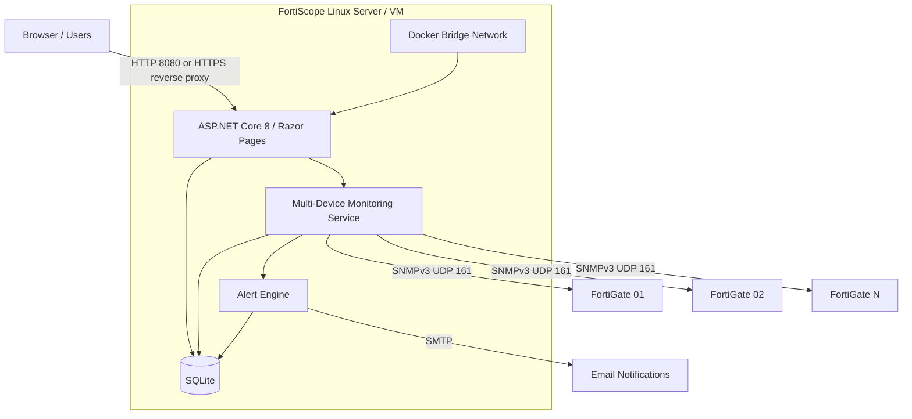

# FortiScope

**Lightweight Multi-Device FortiGate Monitoring & Alerting Platform**

FortiScope is a focused monitoring platform for Fortinet FortiGate firewalls. It collects system and interface metrics over SNMPv3, presents live and historical data in a centralized dashboard, and tracks threshold-based alerts across multiple devices. The application is designed for straightforward deployment in private networks, labs, and internal infrastructure environments.

## Features

- Multi-device FortiGate inventory and monitoring
- SNMPv3 `authPriv` communication
- Live CPU, memory, and active session metrics
- Physical and virtual interface monitoring
- Interface bandwidth and utilization measurements
- Historical system and interface metrics
- Add, edit, enable, disable, test, and delete device management
- Fleet health overview and centralized active alerts
- Configurable CPU, memory, connectivity, and interface traffic thresholds
- Warning, critical, escalation, reminder, and recovery transitions
- Persistent alert/event history with device and interface context
- SMTP email alert and recovery notifications
- Top Interfaces view across enabled and connected devices
- SQLite persistence with automatic Entity Framework Core migrations
- Docker and Docker Compose deployment
- Dashboard access through the Docker host/server IP
- Application health endpoint independent of FortiGate availability
- Automated tests for monitoring calculations, persistence, settings, and alert behavior

## Architecture



FortiScope polls each enabled device independently. Live snapshots drive the dashboard and alert engine, while sampled metrics and alert transitions are stored in SQLite for historical views.

## Tech Stack

- ASP.NET Core 8
- Razor Pages
- Entity Framework Core 8
- SQLite
- SharpSnmpLib and SNMPv3
- Vanilla JavaScript and CSS
- xUnit
- Docker and Docker Compose

## Quick Start with Docker

Requirements: Git, Docker Engine, and the Docker Compose plugin.

```bash
git clone https://github.com/DeSiLencee/FortiScope.git
cd FortiScope
cp .env.example .env
```

Open `.env` and replace the SNMP authentication and privacy password placeholders. Do not commit this file.

```bash
docker compose up -d --build
```

Open the dashboard:

- Server or VM: `http://SERVER_IP:8080`
- Local machine: [http://localhost:8080](http://localhost:8080)

On the first start, the database is created automatically and the device inventory is empty. Select **Add FortiGate**, enter the device management/internal IP and SNMPv3 username, then run **Test Connection**.

## Deploy on a Linux Server

Verify that Docker and Compose are available:

```bash
docker --version
docker compose version
```

Clone and configure the application:

```bash
git clone https://github.com/DeSiLencee/FortiScope.git
cd FortiScope
cp .env.example .env
nano .env
docker compose up -d --build
```

Check the service:

```bash
docker compose ps
docker compose logs -f fortiscope
curl http://localhost:8080/health
```

Find the server address:

```bash
hostname -I
# or
ip addr
```

Allow the dashboard port when a host firewall is enabled. For Ubuntu UFW:

```bash
sudo ufw allow 8080/tcp
```

Users on the permitted network can then open `http://SERVER_IP:8080`. The container uses Docker bridge networking and sends outbound SNMPv3 requests to routable FortiGate management addresses over UDP 161; host networking is not required.

## FortiGate SNMP Requirements

- SNMPv3 must be enabled on each FortiGate.
- The SNMP user must use `authPriv` security.
- Authentication and privacy protocols must match the FortiScope configuration.
- UDP 161 must be reachable from the FortiScope server/container network.
- The FortiScope server IP or trusted management network must be allowed by the FortiGate.
- The username entered in Device Management must match the FortiGate SNMPv3 user.
- Authentication and privacy passwords must match the values stored in the local FortiScope `.env` file.

Use placeholders such as `FORTISCOPE_SERVER_IP`, `SNMP_USERNAME`, `AUTH_PASSWORD`, and `PRIVACY_PASSWORD` when documenting local FortiGate configuration. Never place real credentials in the repository.

## Configuration

Docker Compose reads the following values from `.env`:

| Variable | Default | Description |
| --- | --- | --- |
| `FORTISCOPE_PORT` | `8080` | TCP port published on the Docker host |
| `ASPNETCORE_ENVIRONMENT` | `Production` | ASP.NET Core runtime environment |
| `HttpsRedirectionEnabled` | `false` | Keep disabled for direct HTTP or when a reverse proxy terminates HTTPS |
| `Snmp__Port` | `161` | FortiGate SNMP UDP port |
| `Snmp__Version` | `v3` | Supported SNMP version |
| `Snmp__SecurityLevel` | `authPriv` | Required SNMPv3 security level |
| `Snmp__AuthenticationProtocol` | `SHA1` | Supported authentication protocol |
| `Snmp__PrivacyProtocol` | `AES128` | Supported privacy protocol |
| `Snmp__TimeoutMilliseconds` | `3000` | SNMP request timeout |
| `Snmp__AuthPassword` | required | Shared SNMPv3 authentication password |
| `Snmp__PrivacyPassword` | required | Shared SNMPv3 privacy password |

Double underscores are the standard ASP.NET Core environment-variable separator. Device names, IP addresses, usernames, and enabled states are managed through the dashboard. SMTP settings are stored through the Email Notifications dialog and protected with ASP.NET Core Data Protection.

## Data Persistence

Docker Compose mounts the named volume `fortiscope_data` at `/app/data`. It retains:

- Registered devices
- System and interface metric history
- Alert settings and alert history
- Email notification settings
- Data Protection keys used for stored SMTP credentials

The application creates the SQLite database and applies pending migrations during startup. Container recreation and `docker compose down` preserve the volume. Running `docker compose down -v` deletes it and should only be used when data removal is intentional.

## API Highlights

| Method and path | Purpose |
| --- | --- |
| `GET /health` | Application health independent of device connectivity |
| `GET /api/devices` | Registered FortiGate inventory |
| `GET /api/devices/monitoring/current` | Fleet-level current monitoring summaries |
| `GET /api/devices/{id}/monitoring/current` | Current snapshot for one device |
| `GET /api/history/system?deviceId={id}&range=1h` | Historical CPU, memory, session, and connection data |
| `GET /api/alerts/history?deviceId={id}&range=24h` | Filterable alert transition history |

Device management, interface history, settings, and connection-test endpoints are also used by the dashboard. All frontend requests use same-origin relative paths.

## Project Structure

```text
Configuration/   Strongly typed SNMP and monitoring options
Data/            EF Core context, entities, and database migrations
Models/          API requests, responses, and monitoring snapshots
Services/        SNMP polling, history, alerts, persistence, and email logic
Pages/           Razor Pages dashboard and shared layout
wwwroot/         Vanilla JavaScript, CSS, and static assets
tests/           xUnit test suite
```

## Development

Requirements: .NET 8 SDK.

```bash
dotnet restore
dotnet user-secrets set "Snmp:AuthPassword" "YOUR_AUTH_PASSWORD"
dotnet user-secrets set "Snmp:PrivacyPassword" "YOUR_PRIVACY_PASSWORD"
dotnet run
```

Build and test:

```bash
dotnet build
dotnet test tests/FortiScope.Tests/FortiScope.Tests.csproj
```

Missing SNMP credentials or unreachable devices do not stop the web application. The dashboard and `/health` remain available while monitoring reports the relevant configuration or connection state.

## Docker

```bash
docker compose build
docker compose up -d
docker compose ps
docker compose logs -f fortiscope
```

The application listens on port `8080` inside the container. `FORTISCOPE_PORT` controls the host-side port, and the default Compose mapping is accessible through the server's network interfaces.

## Security Notes

- Use SNMPv3 `authPriv` rather than SNMPv1/v2c communities.
- Never commit `.env`, SQLite files, Data Protection keys, or local user secrets.
- Do not expose UDP 161 to the public internet.
- Restrict FortiGate SNMP access to the FortiScope server IP or trusted management network.
- FortiScope v1 does not include built-in user authentication; do not publish port 8080 directly to the public internet.
- Prefer a private LAN, management VPN, or an HTTPS reverse proxy with appropriate access controls.
- Keep SMTP and SNMP secrets out of application logs and source control.
- Back up the `fortiscope_data` volume before upgrades or host migration.

## Limitations / v1 Scope

- Monitoring is focused on Fortinet FortiGate devices and the SNMP/IF-MIB data they expose.
- SNMPv3 `authPriv` with SHA1 authentication and AES128 privacy is the currently supported protocol profile.
- SNMP authentication and privacy passwords are shared application-level configuration; device IP addresses and usernames are managed per device.
- FortiScope v1 does not include built-in users, roles, or authentication.
- The deployment model is intended primarily for private networks, labs, and internal monitoring environments.
- Email notification delivery depends on an operator-provided SMTP service.

## Testing

The test suite covers interface-rate calculations, persistence policies, database migrations, device management, alert settings, notification decisions, alert history, and interface traffic eligibility/transitions.

```bash
dotnet test tests/FortiScope.Tests/FortiScope.Tests.csproj
```
