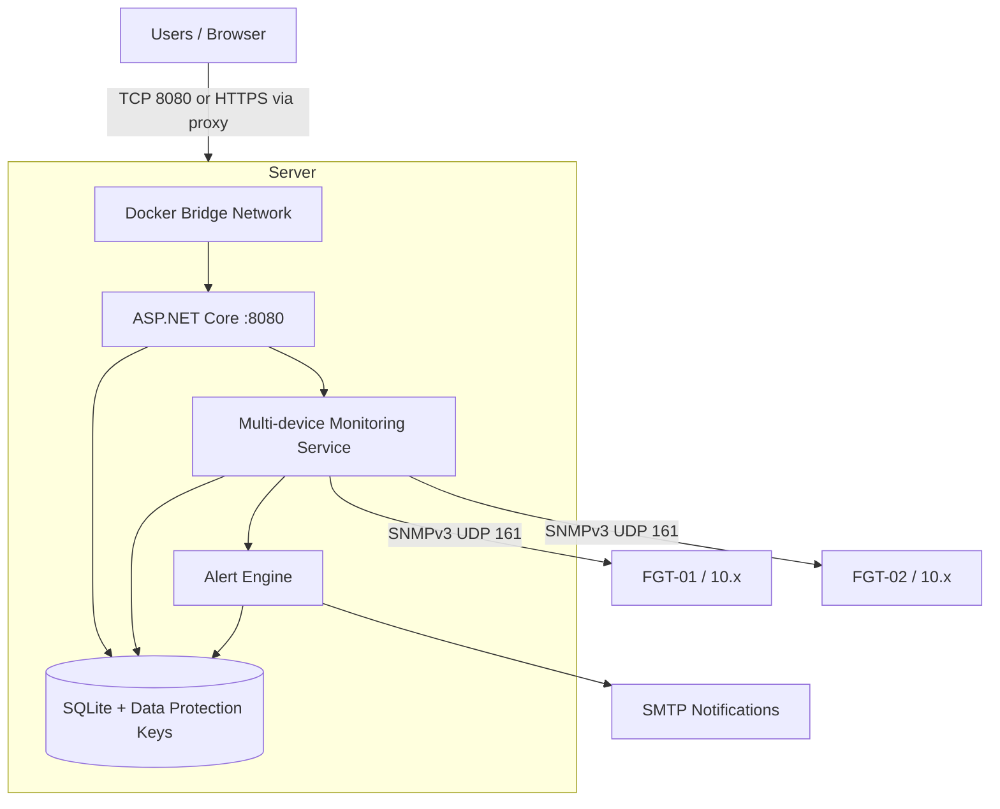

# FortiScope

**Lightweight Multi-Device FortiGate Monitoring & Alerting Platform**

FortiScope is a lightweight monitoring platform for Fortinet FortiGate firewalls. It uses SNMPv3 to collect system and interface metrics and provides historical monitoring, alerting, notifications and device management through a centralized web dashboard.

## Features

- Multi-device FortiGate monitoring
- SNMPv3 `authPriv` communication
- CPU, memory and active session metrics
- Interface bandwidth and utilization monitoring
- Historical system and interface metrics
- Configurable threshold alerts and recovery tracking
- Persistent alert history
- SMTP email notifications
- Add, edit, enable, disable, test and delete device management
- Fleet overview and top interfaces
- SQLite persistence and automatic migrations
- Docker deployment

## Tech Stack

- ASP.NET Core 8 and Razor Pages
- Entity Framework Core 8 and SQLite
- SNMPv3 with SharpSnmpLib
- Vanilla JavaScript and CSS
- Docker and Docker Compose

## Quick Start

Requirements: Git and Docker with the Compose plugin.

```bash
git clone <YOUR_REPOSITORY_URL>
cd FortiScope
cp .env.example .env
```

Edit `.env` and replace both `CHANGE_ME` values with the SNMPv3 authentication and privacy passwords configured on your FortiGate devices. Then start FortiScope:

```bash
docker compose up -d
docker compose ps
```

Open [http://localhost:8080](http://localhost:8080). If `FORTISCOPE_PORT` was changed, use that host port instead. On a new installation the dashboard starts without devices; use **Add FortiGate** to register the first firewall.

Useful commands:

```bash
docker compose logs -f fortiscope
docker compose down
docker compose up -d --build
```

## Deploy on a Linux Server

Install Docker Engine and the Docker Compose plugin, then verify them:

```bash
docker --version
docker compose version
```

Clone, configure and start FortiScope:

```bash
git clone https://github.com/<USER>/FortiScope.git
cd FortiScope
cp .env.example .env
nano .env
docker compose up -d --build
```

Check startup, health and logs:

```bash
docker compose ps
docker compose logs -f fortiscope
curl http://localhost:8080/health
curl http://localhost:8080/api/devices
```

Find the server address with `hostname -I` or `ip addr`. From another computer on the same network, open `http://SERVER_IP:8080`. For example, use `http://192.168.1.50:8080` for a server at `192.168.1.50`. The port mapping binds to all server interfaces, not only loopback.

If UFW is enabled, permit web access from the intended network:

```bash
sudo ufw allow 8080/tcp
```

Do not expose UDP 161 inbound from the public internet. FortiScope requires outbound UDP 161 from its Docker bridge network through the server to each FortiGate:

```text
FortiScope server/container -- SNMPv3 UDP 161 --> FortiGate management IP
```

Docker's normal bridge/NAT routing is sufficient; `network_mode: host` is not required. The FortiGate management address must be routable from the server, and FortiGate should allow SNMP only from the FortiScope server's trusted IP/network.

## Required FortiGate Configuration

- Enable SNMPv3 on the FortiGate.
- Use an `authPriv` user with SHA1 authentication and AES128 privacy.
- Allow the FortiScope host in the FortiGate SNMP configuration.
- Ensure UDP port 161 is reachable from the Docker host/container network.
- Use the same authentication/privacy passwords in FortiGate and FortiScope `.env`.
- Enter each device's IP address and SNMP username through **Add FortiGate**.

A generic FortiOS configuration outline is shown below. Confirm command syntax against the FortiOS version used in your environment:

```text
config system snmp user
    edit "SNMP_USERNAME"
        set security-level auth-priv
        set auth-proto sha
        set auth-pwd AUTH_PASSWORD
        set priv-proto aes
        set priv-pwd PRIVACY_PASSWORD
    next
end
```

Restrict SNMP access to `FORTISCOPE_SERVER_IP` using the appropriate FortiGate interface and trusted-host configuration. FortiScope does not require an SNMPv1/v2c community.

## Configuration

Docker Compose reads local values from `.env`:

| Variable | Default | Purpose |
| --- | --- | --- |
| `FORTISCOPE_PORT` | `8080` | Dashboard port exposed on the Docker host |
| `ASPNETCORE_ENVIRONMENT` | `Production` | ASP.NET Core runtime environment |
| `HttpsRedirectionEnabled` | `false` | Enable only when ASP.NET itself has a usable HTTPS endpoint |
| `Snmp__Port` | `161` | FortiGate SNMP UDP port |
| `Snmp__Version` | `v3` | SNMP protocol version |
| `Snmp__SecurityLevel` | `authPriv` | Required SNMPv3 security level |
| `Snmp__AuthenticationProtocol` | `SHA1` | Authentication protocol |
| `Snmp__PrivacyProtocol` | `AES128` | Privacy protocol |
| `Snmp__TimeoutMilliseconds` | `3000` | Per-request timeout |
| `Snmp__AuthPassword` | required | Shared SNMPv3 authentication password |
| `Snmp__PrivacyPassword` | required | Shared SNMPv3 privacy password |

Double underscores are the standard ASP.NET Core environment-variable separator. Device IP addresses, names and SNMP usernames are managed through the dashboard. SMTP configuration is managed through the Email Notifications dialog and encrypted using ASP.NET Core Data Protection; it does not belong in `.env`.

Never commit `.env`. The repository contains only `.env.example` placeholders.

## Data Persistence

Compose mounts the Docker named volume `fortiscope_data` at `/app/data` in the container. It contains:

- `fortiscope.db` and its SQLite journal files
- Data Protection keys used to decrypt stored SMTP credentials

Database migrations run automatically during startup. The first start creates an empty database, default alert settings and default disabled email settings. Container replacement and `docker compose down` do not delete the named volume. Do not use `docker compose down -v` unless you intend to erase FortiScope data. Back up the volume before upgrades.

The named volume is initialized for the image's non-root `app` user, avoiding Linux bind-mount ownership problems. Inspect it with `docker volume inspect fortiscope_data`.

## Health Check

`GET /health` confirms that the web application is running and returns:

```json
{"status":"healthy"}
```

Docker uses this endpoint for container health. FortiGate availability is intentionally excluded, so an offline device does not mark the container unhealthy.

## Security Notes

- Use SNMPv3 `authPriv`; do not expose SNMPv1/v2c communities.
- Do not commit `.env`, SQLite files, Data Protection keys or local user secrets.
- Restrict UDP 161 to the FortiScope host and trusted management networks.
- Protect and back up the `fortiscope_data` volume because it contains monitoring data, settings and encryption keys.
- Use a dedicated least-privilege SMTP account.
- Place FortiScope behind an HTTPS reverse proxy before internet-facing deployment.
- FortiScope v1 has no application authentication; restrict network access accordingly.

Do not publish TCP 8080 directly to the public internet. Prefer a private LAN or VPN. For internet-facing use, terminate HTTPS and enforce access controls at a reverse proxy:

```text
Internet -> HTTPS 443 -> Nginx/Caddy/Traefik -> FortiScope 8080
```

Minimal Nginx example:

```nginx
server {
    listen 80;
    server_name fortiscope.example.com;

    location / {
        proxy_pass http://127.0.0.1:8080;
        proxy_set_header Host $host;
        proxy_set_header X-Real-IP $remote_addr;
        proxy_set_header X-Forwarded-For $proxy_add_x_forwarded_for;
        proxy_set_header X-Forwarded-Proto $scheme;
    }
}
```

Configure TLS on the reverse proxy. Keep `HttpsRedirectionEnabled=false` when the proxy handles HTTPS; direct HTTP container deployments then remain reachable without redirecting to a nonexistent certificate endpoint.

## Local .NET Development

Requirements: .NET 8 SDK and optionally the EF Core CLI.

```bash
dotnet restore
dotnet user-secrets set "Snmp:AuthPassword" "YOUR_AUTH_PASSWORD"
dotnet user-secrets set "Snmp:PrivacyPassword" "YOUR_PRIVACY_PASSWORD"
dotnet run
```

Missing SNMP credentials or unreachable devices do not crash the application. The dashboard and `/health` remain available while monitoring reports the configuration or connection error.

Run validation with:

```bash
dotnet build
dotnet test tests/FortiScope.Tests/FortiScope.Tests.csproj
node --check wwwroot/js/dashboard.js
```

## Project Structure

```text
Configuration/       Strongly typed application options
Data/                EF Core context, entities and migrations
Models/              API and monitoring models
Pages/               Razor Pages dashboard and shared layout
Services/            SNMP polling, history, alerts and notifications
tests/                xUnit test project
wwwroot/              JavaScript, CSS and static assets
Dockerfile            Production multi-stage image
docker-compose.yml    Single-service deployment and persistent storage
```

## Architecture



## Screenshots

Screenshots are not included yet. Suggested additions:

- `docs/screenshots/dashboard.png`
- `docs/screenshots/device-management.png`
- `docs/screenshots/alert-history.png`

## License

No project-level license file is currently included. Add an appropriate license before distributing or accepting external contributions.
